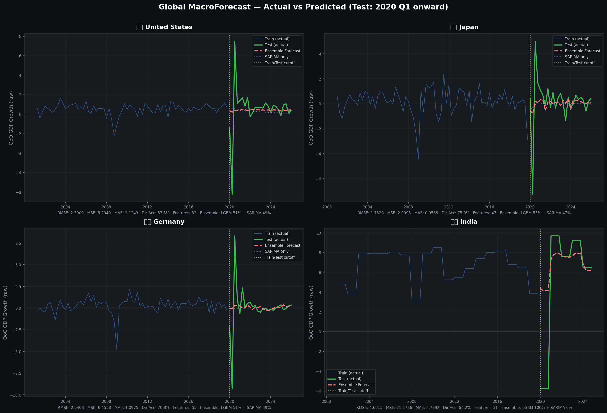
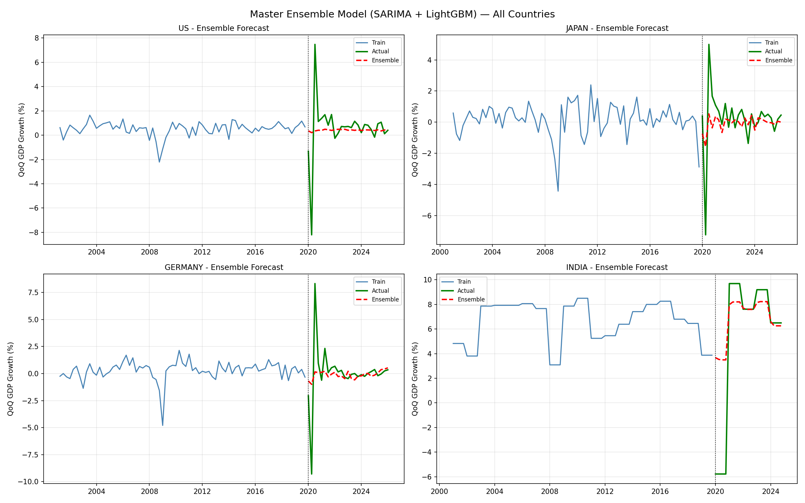

> ⚠️ **PROPRIETARY & CONFIDENTIAL**  
> This repository contains the architectural implementation of the Global MacroForecast pipeline. While the core algorithmic architecture and ensemble weights (`.pkl`) are provided for **strict portfolio evaluation purposes only**, access to live proprietary data streams and automated re-training triggers have been restricted to protect intellectual property.

# 📈 Global MacroForecast | GDP Nowcasting Engine

**🌍 Live Dashboard:** [https://global-macro-forecast.vercel.app/](https://global-macro-forecast.vercel.app/)



An end-to-end, full-stack macroeconomic forecasting system designed to predict Quarter-on-Quarter (QoQ) GDP growth for four major global economies: **United States, Germany, Japan, and India**. 

Built with an ultra-premium "Data Journalism" aesthetic, this system utilizes a dynamically weighted **Machine Learning Ensemble** to forecast up to 8 quarters into the future.

---

## 🎯 Model Performance & Optimization

Our rigorous chronological hold-out validation ensures zero future-data leakage. The ensemble model (combining LightGBM and SARIMA) achieves the following metrics on unseen test data (**Test period: 2020 Q1 → Present**). Hyperparameters were tuned using **Optuna v4.2** on Kaggle.



| Economy | Acc | RMSE | MAE | Ensemble Weighting | Key Optuna Params |
| :--- | :---: | :---: | :---: | :--- | :--- |
| 🇺🇸 **US** | **87.5%** | 2.30 | 1.12 | LGBM 51% + SARIMA 49% | `lr: 0.03`, `depth: 3`, `leaves: 8` |
| 🇯🇵 **Japan** | 75.0% | 1.61 | 0.96 | LGBM 56% + SARIMA 44% | `lr: 0.09`, `depth: 3`, `leaves: 12` |
| 🇩🇪 **Germany** | 70.8% | 2.41 | 1.12 | LGBM 53% + SARIMA 47% | `lr: 0.05`, `depth: 4`, `leaves: 17` |
| 🇮🇳 **India** | **84.2%** | 4.25 | 2.41 | LGBM 100% (no SARIMA) | `lr: 0.03`, `depth: 3` (Manual), `leaves: 8` |

> *Directional Accuracy = model's ability to correctly predict GDP expansion vs contraction relative to the prior quarter. Deep trees were manually restricted for India due to low variance in annual-to-quarterly forward-filled data.*

---

## ✨ Key Features

- **Live Macroeconomic Forecasting:** Generates 8-quarter (2-year) forward-looking predictions for GDP growth.
- **Ensemble ML Architecture:** Combines the non-linear relationship capturing power of **LightGBM** with the strong linear trend and seasonality tracking of **SARIMA**. Inverse RMSE Weighting (`weight = 1/RMSE`) automatically favors the model with the lowest historical error per country.
- **Optuna Hyperparameter Tuning:** Country-specific LightGBM parameters tuned via Bayesian optimization (TPE) on Kaggle, with search space explicitly constrained to prevent overfitting on small macroeconomic datasets.
- **High-Performance Static Deployment:** Models pre-compute predictions locally which are exported to a static JSON file (`forecasts.json`), allowing the frontend to be deployed globally on Vercel with zero cold-starts and 100% free hosting.
- **Premium Fintech UI/UX:** A responsive, "Corporate Light" themed landing page built in Vanilla HTML/CSS/JS. Features interactive expanding country cards, smooth `Chart.js` rendering, and floating interactive geometric particle backgrounds.
- **Zero Data Leakage:** Strict chronological train/test split (cutoff: 2019 Q4). All lag features use `.shift()` validated by unit tests with 1e-6 tolerance.

---

## 📂 Project Structure

```text
Global-MacroForecast/
├── data/                  # Raw and processed datasets (FRED, WorldBank)
├── frontend/              # Vanilla HTML/CSS/JS Dashboard
│   ├── css/style.css      # Corporate Light Theme & Particle Animations
│   ├── js/dashboard.js    # Chart.js rendering & static JSON fetching
│   └── data/forecasts.json # Pre-computed model predictions
├── models_saved/          # Serialized LightGBM & SARIMA models (.pkl)
├── notebooks/             # EDA, baseline models, and experimental files
├── Optuna_Test/           # Hyperparameter tuning notebooks and CSV logs
├── src/
│   ├── api/               # FastAPI backend (Development only)
│   ├── data/              # Feature engineering scripts
│   ├── models/            # Country-specific training pipelines
│   └── scripts/           # Utilities (e.g., export_forecasts.py)
└── requirements.txt       # Python dependencies
```

---

## 🛠️ Technology Stack

**Backend (Machine Learning & API):**
* Python 3.10+
* FastAPI & Uvicorn (High-performance Async API)
* LightGBM (Gradient Boosted Decision Trees)
* Statsmodels (SARIMA)
* Optuna (Bayesian Hyperparameter Optimization)
* Pandas & Scikit-Learn (Data Preprocessing & Feature Engineering)

**Frontend (Dashboard):**
* HTML5 (Semantic Structure)
* CSS3 (Grid/Flexbox, Glassmorphism, CSS Variables)
* Vanilla JavaScript (ES6+ Asynchronous Fetching & DOM Manipulation)
* Chart.js (Data Visualization)

**Data Sources:**
* FRED (Federal Reserve Economic Data) API
* World Bank Open Data
* OECD Leading Indicators

---

## 🚀 How to Run Locally

### 1. Clone the Repository
```bash
git clone https://github.com/Yash1bajpai/Global-MacroForecast.git
cd Global-MacroForecast
```

### 2. Set Up the Python Environment
```bash
python -m venv .venv
# On Windows:
.venv\Scripts\activate
# On Mac/Linux:
# source .venv/bin/activate

pip install -r requirements.txt
```

### 3. Generate Latest Forecasts
Run the export script to load your local Machine Learning models, compute the latest 8-quarter predictions, and save them to the static JSON file:
```bash
python src/scripts/export_forecasts.py
```
*Note: Pushing the updated JSON to GitHub will automatically trigger a Vercel deployment to update the live site.*

---

## 👨‍💻 Author

**Built by Yash Bajpai**
* 💼 **LinkedIn:** [Yash Bajpai](https://linkedin.com/in/yash-bajpai-b5a86332a)
* 📧 **Email:** bajpaiyash2707@gmail.com

---
*© 2026 Yash Bajpai. All rights reserved.*
licence adb