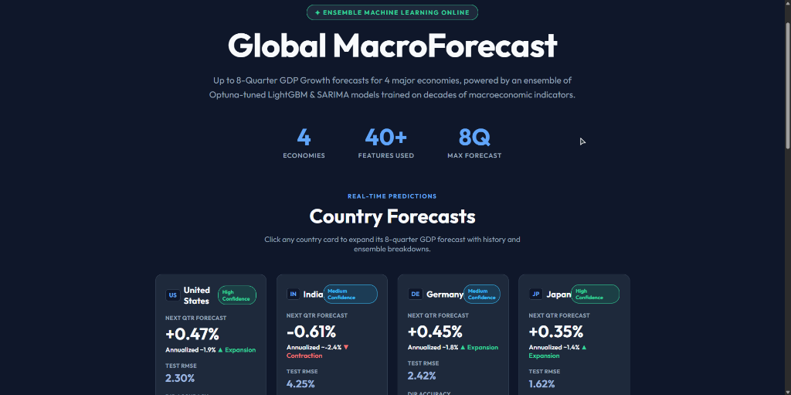
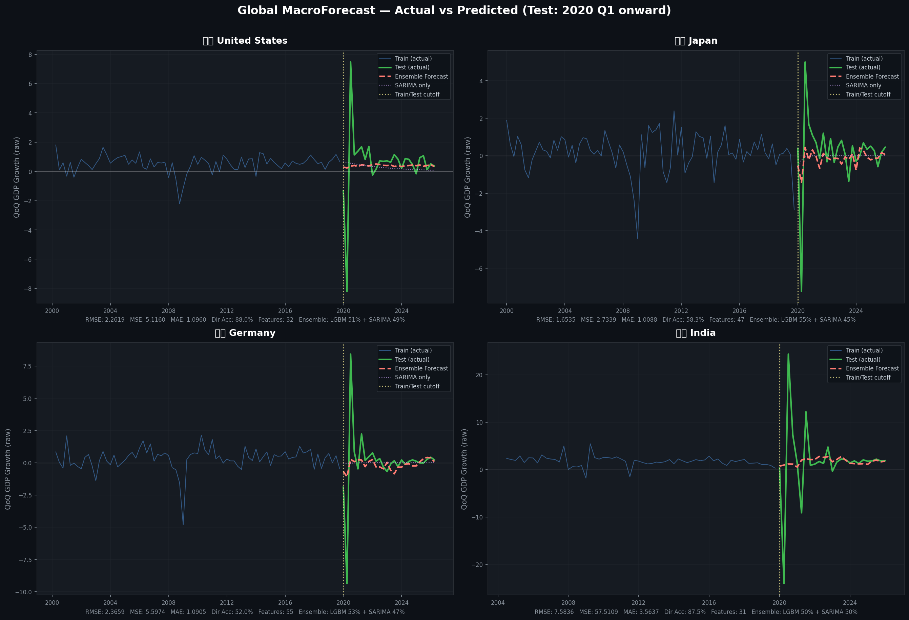
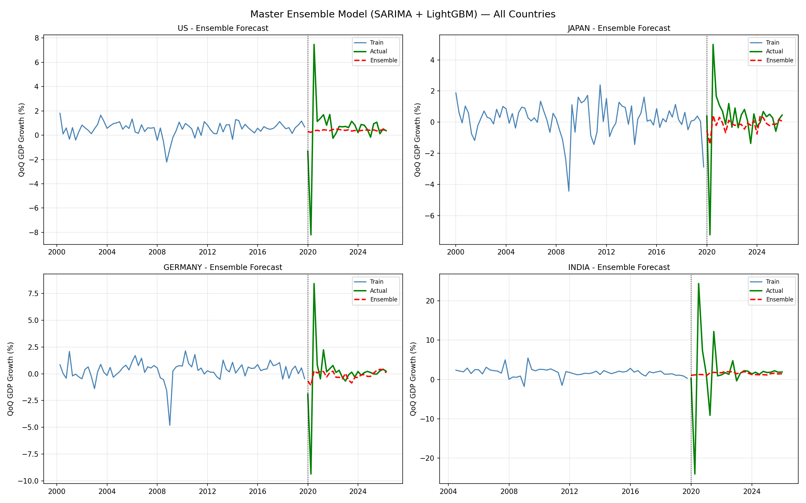

> ⚠️ **PROPRIETARY & CONFIDENTIAL**  
> This repository contains the architectural implementation of the Global MacroForecast pipeline. While the core algorithmic architecture and ensemble weights (`.pkl`) are provided for **strict portfolio evaluation purposes only**, access to live proprietary data streams and automated re-training triggers have been restricted to protect intellectual property.

# 📈 Global MacroForecast | GDP Nowcasting Engine

**🌍 Live Dashboard:** [https://global-macro-forecast.vercel.app/](https://global-macro-forecast.vercel.app/)





An end-to-end, full-stack macroeconomic forecasting system designed to predict Quarter-on-Quarter (QoQ) GDP growth for four major global economies: **United States, Germany, Japan, and India**. 

Built with an ultra-premium "Data Journalism" aesthetic, this system utilizes a dynamically weighted **Machine Learning Ensemble** to forecast up to 8 quarters into the future.

---

## 🎯 Model Performance & Optimization

Our rigorous chronological hold-out validation ensures zero future-data leakage. The ensemble model (combining LightGBM and SARIMA) achieves the following metrics on unseen test data (**Test period: 2020 Q1 → Present**). Hyperparameters were tuned using **Optuna v4.2** on Kaggle.



| Economy | Dir Acc | RMSE | MAE | Ensemble Weighting | Key Optuna Params |
| :--- | :---: | :---: | :---: | :--- | :--- |
| 🇺🇸 **US** | **88.0%** | 2.26 | 1.10 | LGBM 51% + SARIMA 49% | `lr: 0.03`, `depth: 3`, `leaves: 8` |
| 🇯🇵 **Japan** | 58.3% | 1.65 | 1.01 | LGBM 55% + SARIMA 45% | `lr: 0.09`, `depth: 3`, `leaves: 12` |
| 🇩🇪 **Germany** | 52.0% | 2.37 | 1.09 | LGBM 53% + SARIMA 47% | `lr: 0.05`, `depth: 4`, `leaves: 17` |
| 🇮🇳 **India** | **87.5%** | 7.60 | 3.54 | LGBM 50% + SARIMA 50% | `lr: 0.03`, `depth: 3` (Manual), `leaves: 8` |

> *Directional Accuracy = model's ability to correctly predict GDP expansion vs contraction relative to the prior quarter. Deep trees were manually restricted for India due to low variance in the target. Japan and Germany publish QoQ growth rates that hover near zero, so sign prediction there is inherently noisy. All models were retrained on a leakage-free feature set (rolling YoY aggregates are shifted by one quarter). India's GDP target is the OECD Quarterly National Accounts QoQ series (via FRED), replacing the previously interpolated annual data — this cut India's ensemble RMSE from 11.51 to 7.60 and made a genuine India SARIMA possible.*

---

## ✨ Key Features

- **Live Macroeconomic Forecasting:** Generates 8-quarter (2-year) forward-looking predictions for GDP growth.
- **Ensemble ML Architecture:** Combines the non-linear relationship capturing power of **LightGBM** with the strong linear trend and seasonality tracking of **SARIMA**. Inverse RMSE Weighting (`weight = 1/RMSE`) automatically favors the model with the lowest historical error per country.
- **Optuna Hyperparameter Tuning:** Country-specific LightGBM parameters tuned via Bayesian optimization (TPE) on Kaggle, with search space explicitly constrained to prevent overfitting on small macroeconomic datasets.
- **Hybrid Production Architecture:** Combines a high-speed frontend deployed on **Vercel** with a live asynchronous **FastAPI** backend hosted on **Render**. The dashboard paints instantly from a bundled static snapshot, then upgrades to live API data in the background — so a cold-starting backend never leaves the page blank. Uses HTTP `Cache-Control: max-age=86400` middleware for 24-hour caching.
- **API Keep-Warm Uptime Bot:** A scheduled GitHub Action (`keep_warm.yml`) pings the Render health endpoint every 5 minutes, keeping the free-tier backend out of cold-start sleep for real visitors. The navbar badge shows true backend state (Live / Static Snapshot).
- **Automated Cloud Retraining:** Configured with a monthly GitHub Actions scheduled workflow (`auto_update.yml`) that fetches fresh macroeconomic indicators from FRED/World Bank/OECD APIs, rebuilds features, retrains every model, regenerates forecasts, runs the test suite, enforces a data-freshness guard, and commits updated artifacts automatically.
- **Premium Fintech UI/UX:** A responsive, "Corporate Light" themed landing page built in Vanilla HTML/CSS/JS. Features interactive expanding country cards, smooth `Chart.js` rendering, and floating interactive geometric particle backgrounds.
- **Zero Data Leakage:** Strict chronological train/test split (cutoff: 2019 Q4). All lag features and rolling aggregates (including the YoY sum) use `.shift()` validated by unit tests with 1e-6 tolerance.

---

## 📂 Project Structure

```text
Global-MacroForecast/
├── data/                  # Raw and processed datasets (FRED, WorldBank)
├── frontend/              # Vanilla HTML/CSS/JS Dashboard
│   ├── css/style.css      # Corporate Light Theme & Particle Animations
│   ├── js/dashboard.js    # Chart.js rendering & static JSON fetching
│   └── data/forecasts.json # Pre-computed model predictions
├── models_saved/          # Serialized LightGBM & SARIMA models (.pkl)
├── notebooks/             # EDA, baseline models, and experimental files
├── Optuna_Test/           # Hyperparameter tuning notebooks and CSV logs
├── src/
│   ├── api/               # FastAPI backend (Development only)
│   ├── data/              # Ingestion, preprocessing & feature engineering
│   │   └── build_features.py  # Reproducible lag/rolling feature builder (all countries)
│   ├── models/            # Country-specific training pipelines (LightGBM + SARIMA)
│   └── scripts/           # Utilities (e.g., export_forecasts.py)
└── requirements.txt       # Python dependencies
```

---

## 🛠️ Technology Stack

**Backend (Machine Learning & API):**
* Python 3.10+
* FastAPI & Uvicorn (High-performance Async API)
* LightGBM (Gradient Boosted Decision Trees)
* Statsmodels (SARIMA)
* Optuna (Bayesian Hyperparameter Optimization)
* Pandas & Scikit-Learn (Data Preprocessing & Feature Engineering)

**Frontend (Dashboard):**
* HTML5 (Semantic Structure)
* CSS3 (Grid/Flexbox, Glassmorphism, CSS Variables)
* Vanilla JavaScript (ES6+ Asynchronous Fetching & DOM Manipulation)
* Chart.js (Data Visualization)

**Data Sources:**
* FRED (Federal Reserve Economic Data) API
* OECD Quarterly National Accounts (via FRED mirroring) — quarterly GDP for India & Japan
* World Bank Open Data
* OECD Leading Indicators

---

## 🚀 How to Run Locally

### 1. Clone the Repository
```bash
git clone https://github.com/Yash1bajpai/Global-MacroForecast.git
cd Global-MacroForecast
```

### 2. Set Up the Python Environment
```bash
python -m venv .venv
# On Windows:
.venv\Scripts\activate
# On Mac/Linux:
# source .venv/bin/activate

pip install -r requirements.txt
```

### 3. Run the Full Pipeline
Fetch the latest macro data, rebuild features, retrain all models, and evaluate:

```bash
python src/data/fetch_all.py          # FRED + World Bank + OECD (requires FRED_API_KEY in .env)
python src/data/preprocess.py         # Build quarterly master tables
python src/data/build_features.py     # Build lag/rolling feature tables
python src/models/master_ensemble.py  # Retrain + regenerate model_summary.csv weights
python tests/test_pipeline.py         # Sanity + leakage tests
```

### 4. Generate Latest Forecasts
Run the export script to load your local Machine Learning models, compute the latest 8-quarter predictions, and save them to the static JSON file:
```bash
python src/scripts/export_forecasts.py
```
*Note: Pushing the updated JSON to GitHub will automatically trigger a Vercel deployment to update the live site. The monthly `auto_update.yml` GitHub Action runs this entire pipeline end-to-end.*

---

## 👨‍💻 Author

**Built by Yash Bajpai**
* 💼 **LinkedIn:** [Yash Bajpai](https://linkedin.com/in/yash-bajpai-b5a86332a)
* 📧 **Email:** bajpaiyash2707@gmail.com

## 📜 License

Distributed under the MIT License. See [`LICENSE`](LICENSE) for more information.

---
*© 2026 Yash Bajpai. Licensed under the MIT License.*